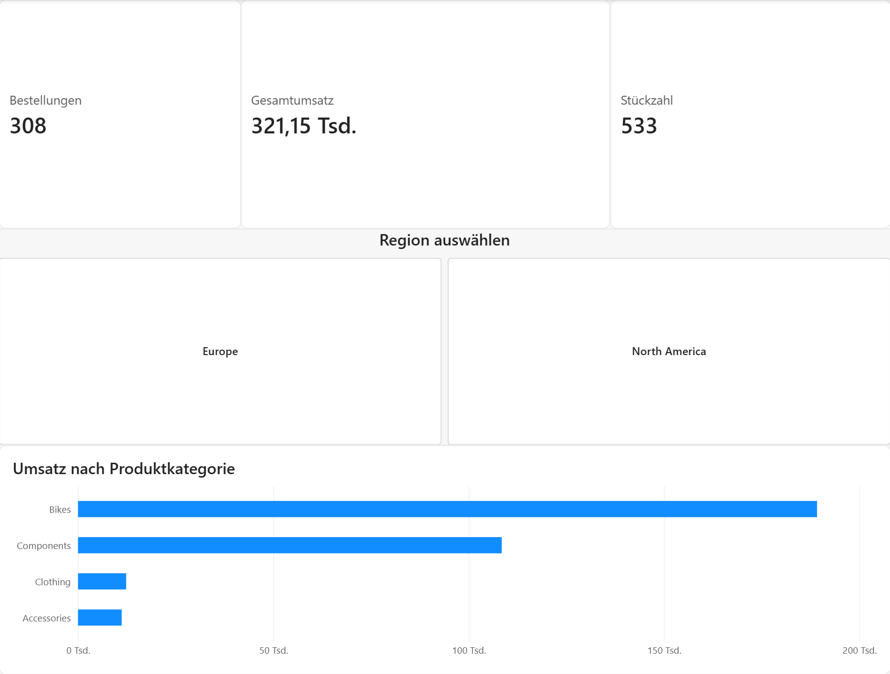

# Sales Dashboard 2024

## Projektübersicht

Dieses Projekt entstand im Rahmen meiner Umschulung im Bereich Data Analytics. Das interaktive Power-BI-Dashboard dient zur Analyse von Umsatz, Gewinn und regionaler Verkaufsentwicklung im Jahr 2024.

## Projektziel

Ziel des Projekts war es, Verkaufsdaten übersichtlich aufzubereiten und wichtige Entwicklungen sowie Zusammenhänge in einem interaktiven Dashboard darzustellen. Dadurch können Kennzahlen schnell erfasst und unterschiedliche Bereiche miteinander verglichen werden.

## Arbeitsschritte

* Daten in Power BI importieren
* Daten prüfen und aufbereiten
* Datenmodell und Beziehungen kontrollieren
* Kennzahlen für die Analyse erstellen
* Geeignete Diagramme und Filter auswählen
* Dashboard übersichtlich und nutzerfreundlich gestalten
* Ergebnisse prüfen und dokumentieren

## Verwendete Werkzeuge

* Microsoft Power BI
* Power Query
* DAX
* Datenmodellierung
* Datenvisualisierung

## Enthaltene Dateien

* `Sales Dashboard 2024.pbix` – vollständige Power-BI-Projektdatei
* `Zusammenfassung der durchgeführten Arbeitsschritte – Sales Dashboard 2024.pdf` – Projektdokumentation

## Verwendung

Die PBIX-Datei kann mit Microsoft Power BI Desktop geöffnet werden. Die PDF-Datei enthält eine Zusammenfassung der durchgeführten Arbeitsschritte.

## Autor

Jesco-Joachim Schnebel
Angehender Data Analyst
[GitHub-Profil](https://github.com/jescojoachimschnebel)
[XING-Portfolio](https://www.xing.com/profile/JescoJoachim_Schnebel/portfolio)
